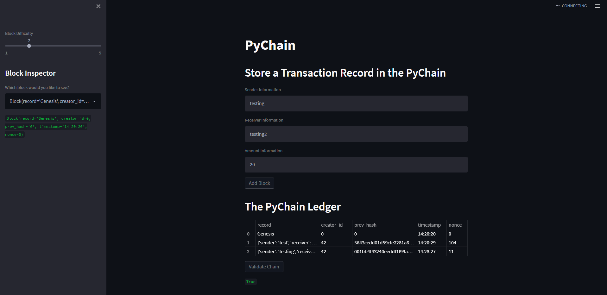

# PyChain_Ledger
UofT Week 18

- Create a Record Data Class
- Modify the Existing Block Data Class to Store Record Data
- Add Relevant User Inputs to the Streamlit Interface
- Test the PyChain Ledger by Storing Records

In this application we are able to validate a block within the blockchain using prrof-of-work to create a ledger of trasnactions. 

